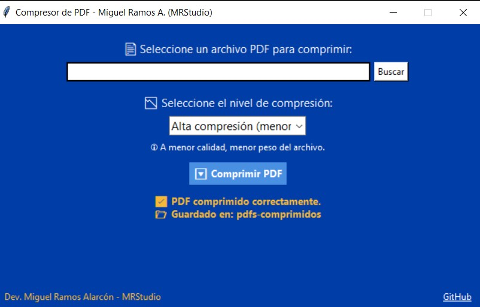
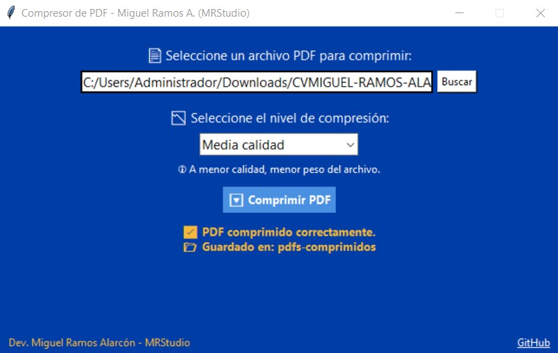

# 📄 Compresor de PDF - Aplicación de Escritorio en Python

Una herramienta de escritorio moderna, intuitiva y ligera para **comprimir archivos `.pdf`** con distintos niveles de calidad visual, desarrollada en **Python** usando **Tkinter**, **Ghostscript** y **PyInstaller**.

> ✅ Creado por: [**Miguel Ramos Alarcón**](https://pe.linkedin.com/in/miguel-alonso-ramos-alarcon)  
> 🧑‍💼 **Programador Web | Especialista SEO | Soporte TI**

---

## 🚀 Características

- 🖥 **Interfaz gráfica elegante y profesional** (Tkinter, estilo corporativo)
- 🔄 **Compresión con un clic**, mediante Ghostscript
- 📉 **Tres niveles de calidad**: Alta, media y alta compresión
- 📁 **Apertura automática de la carpeta de destino**
- ⚡ **Compresión sin consola** (modo silencioso con PyInstaller)
- 🧪 Compatible con cualquier Windows (sin instalación de Python)
- 🎨 **Branding MRStudio**, íconos personalizados y diseño UX/UI optimizado
- 📦 Alternativa **offline** a iLovePDF o SmallPDF

---

## 🖼️ Capturas de pantalla

| Interfaz principal                             | Modal de compresión en progreso                |
|-----------------------------------------------|-----------------------------------------------|
|  |  |

---

## 🔧 Requisitos técnicos

- Este `.exe` es **portable**: no requiere instalación
- Compatible con **Windows 7 / 10 / 11**
- Utiliza **Ghostscript** como motor de compresión PDF
- No necesita tener **Python** instalado

> 💡 Si prefieres no incluir `gswin64c.exe` por el tamaño del archivo, puedes descargarlo manualmente:

🔗 **Descargar Ghostscript:** [https://ghostscript.com/releases/gsdnld.html](https://ghostscript.com/releases/gsdnld.html)  
O versión precompilada recomendada (Windows 64 bits):  
👉 [https://www.ghostscript.com/download/gsdnld.html](https://www.ghostscript.com/download/gsdnld.html)

**Ubicación recomendada:**
compresor-pdf/
│
├── Compresor_PDF.exe
├── gswin64c.exe ← colocar aquí
└── ...

---

## 📦 Estructura de carpetas
compresor-pdf/
│
├── Compresor_PDF.exe # Ejecutable final
├── compresor-pdf.py # Código fuente (GUI + lógica)
├── compresor-pdf.spec # Archivo de configuración para PyInstaller
├── gswin64c.exe # Motor de compresión Ghostscript (opcional)
├── logo_miguel.ico # Ícono personalizado MRStudio
├── README.md # Este archivo
└── screenshots/ # Capturas para mostrar uso


---

## ✨ Fragmentos destacados del código

### 💡 Ejecución silenciosa de Ghostscript

```python
comando = [
    gs_path,
    "-sDEVICE=pdfwrite",
    "-dCompatibilityLevel=1.4",
    f"-dPDFSETTINGS={configuracion}",
    "-dNOPAUSE",
    "-dQUIET",
    "-dBATCH",
    f"-sOutputFile={archivo_salida}",
    archivo
]
subprocess.run(comando, check=True)
```

### 📬 Contáctame
Desarrollado por Miguel Ramos Alarcón
📌 [LinkedIn](https://pe.linkedin.com/in/miguel-alonso-ramos-alarcon)  
📁 [GitHub](https://github.com/miguelramosalarcon)  

> [!IMPORTANT]
> _"En medio de la adversidad, reside la oportunidad" — Albert Einstein_

🧪 Licencia
Este proyecto está licenciado bajo la MIT License. Eres libre de usar, modificar y compartir, siempre reconociendo la autoría.


---