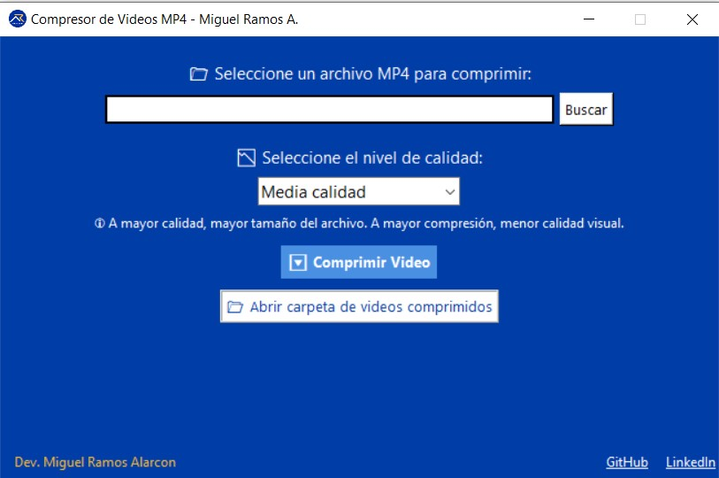

# 🎬 Compresor de Videos MP4 - Aplicación de Escritorio en Python

Una herramienta de escritorio moderna, intuitiva y ligera para **comprimir archivos de video `.mp4`** con distintos niveles de calidad visual, desarrollada en Python usando Tkinter, FFmpeg y PyInstaller.

> ✅ Creado por: [**Miguel Ramos Alarcón**](https://pe.linkedin.com/in/miguel-alonso-ramos-alarcon)  
> 🧑‍💼 **Programador Web | Especialista SEO | Soporte TI**

---

## 🚀 Características

- 🖥 **Interfaz gráfica elegante** (Tkinter, estilo corporativo)
- 🔄 **Compresión con un clic**, usando FFmpeg embebido
- 📉 **Tres niveles de calidad**: Alta, media, baja
- 📁 **Apertura automática de la carpeta de destino**
- ⚡ **Compresión sin consola** (modo silencioso con PyInstaller)
- 🧪 Compatible con cualquier Windows (sin necesidad de instalación)
- 🎨 Branding personalizado, íconos y diseño UX/UX profesional

---

## 🖼️ Capturas de pantalla

| Interfaz principal                             | Modal de compresión en progreso                |
|-----------------------------------------------|-----------------------------------------------|
|     |           |

---

## 🔧 Requisitos técnicos

- Este `.exe` es **portable**: no requiere instalación
- Compatible con **Windows 7 / 10 / 11**
- Ya incluye **FFmpeg integrado**
- No necesitas tener Python instalado

---

## 📦 Estructura de carpetas
```
compresor-videos-mp4/
│
├── Compresor_MP4.exe # Ejecutable final
├── compresor_mp4.py # Código fuente (GUI + lógica)
├── ffmpeg.exe # Motor de compresión
├── logo_miguel.ico # Ícono personalizado
├── README.md # Este archivo
└── screenshots/ # Capturas para mostrar uso
```

## ✨ Fragmentos destacados del código

### 💡 Interfaz centrada y responsiva

```python
subprocess.run(
    ["ffmpeg", "-i", archivo, "-vcodec", "libx264", "-crf", crf, "-preset", "medium", "-y", archivo_salida],
    check=True,
    creationflags=subprocess.CREATE_NO_WINDOW if platform.system() == "Windows" else 0
)
```
✔ Este código ejecuta FFmpeg de forma silenciosa para comprimir el video sin abrir ventanas de consola.

---
📁 ¿Dónde se guarda el video comprimido?
Los archivos comprimidos se guardan automáticamente en la carpeta, la cual sea automaticamente al ejecutar el .exe:
```
/videos-comprimidos
```

### Descargar ejecutable
👉 Puedes descargar el .exe ya listo desde la sección Releases del repositorio o directamente desde esta carpeta.

### 📬 Contáctame
Desarrollado con 💙 por Miguel Ramos Alarcón
📌 [LinkedIn](https://pe.linkedin.com/in/miguel-alonso-ramos-alarcon)  
📁 [GitHub](https://github.com/miguelramosalarcon)  

> [!IMPORTANT]
> _"En medio de la adversidad, reside la oportunidad" — Albert Einstein_

🧪 Licencia
Este proyecto está licenciado bajo la MIT License. Eres libre de usar, modificar y compartir, siempre reconociendo la autoría.


---
