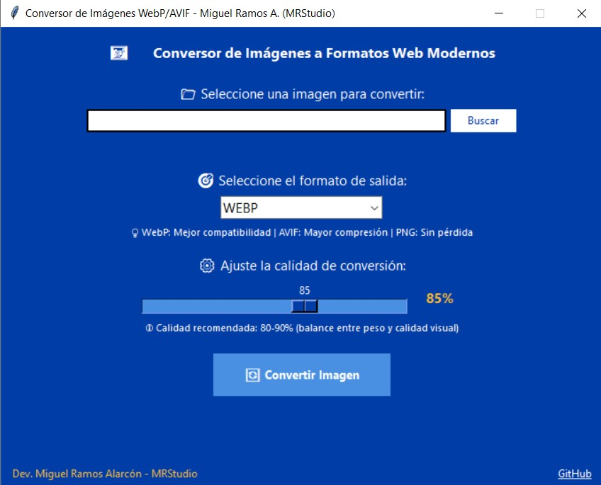

# 🖼️ Conversor de Imágenes a WebP/AVIF - Aplicación de Escritorio en Python

Una herramienta de escritorio moderna, intuitiva y ligera para **convertir imágenes a formatos web modernos** (`WebP`, `AVIF`, `PNG`, `JPG`) con control de calidad ajustable, desarrollada en **Python** usando **Tkinter**, **Pillow** y **PyInstaller**.

> ✅ Creado por: [**Miguel Ramos Alarcón**](https://pe.linkedin.com/in/miguel-alonso-ramos-alarcon)  
> 🧑‍💼 **Programador Web | Especialista SEO | Soporte TI**

---

## 🚀 Características

- 🖥 **Interfaz gráfica elegante y profesional** (Tkinter, estilo corporativo)
- 🔄 **Conversión con un clic**, optimizada con Pillow
- 🎨 **Cuatro formatos de salida**: WebP, AVIF, PNG y JPG
- 📊 **Control de calidad ajustable** (60-100%) con slider visual
- 📈 **Estadísticas en tiempo real**: peso original vs convertido + % de reducción
- 📁 **Apertura automática de la carpeta de destino**
- ⚡ **Sin dependencias externas**, todo empaquetado en el `.exe`
- 🧪 Compatible con cualquier Windows (sin instalación de Python)
- 🎯 **Optimizado para Core Web Vitals** y performance web
- 🎨 **Branding MRStudio**, diseño UX/UI optimizado
- 📦 Alternativa **offline** a servicios web como TinyPNG o Squoosh

---

## 🖼️ Capturas de pantalla

| Interfaz principal                             | Modal de conversión en progreso                |
|-----------------------------------------------|-----------------------------------------------|
|  |

---

## 🔧 Requisitos técnicos

- Este `.exe` es **portable**: no requiere instalación
- Compatible con **Windows 7 / 10 / 11**
- Utiliza **Pillow** como motor de procesamiento de imágenes
- No necesita tener **Python** instalado
- Tamaño del ejecutable: ~20-30 MB (incluye todas las dependencias)

> 💡 **¿Por qué WebP y AVIF?**
> - **WebP**: Reducción del 25-35% vs JPEG | Compatibilidad: ~97%
> - **AVIF**: Reducción del 50% vs JPEG | El futuro del formato web | Compatibilidad: ~90%

---

## 📦 Estructura de carpetas

```
conversor-imagenes/
│
├── Conversor_imagenes.exe  # Ejecutable final
├── conversor_imagenes.py            # Código fuente (GUI + lógica)
├── requirements.txt                 # Dependencias Python
├── README.md                        # Este archivo
├── imagenes-convertidas/            # Carpeta de salida (se crea automáticamente)
└── screenshots/                     # Capturas para mostrar uso
```

---

## 🎨 Uso de la aplicación

1. **Ejecuta** el archivo `.exe`
2. Haz clic en **"Buscar"** para seleccionar una imagen
3. **Elige el formato de salida**: WebP (recomendado), AVIF, PNG o JPG
4. **Ajusta la calidad** con el slider (80-90% recomendado)
5. Haz clic en **"Convertir Imagen"**
6. La carpeta con tu imagen convertida se abrirá automáticamente

---

## 🌐 Formatos soportados

### 📥 **Formatos de entrada:**
- JPEG (.jpg, .jpeg)
- PNG (.png)
- BMP (.bmp)
- GIF (.gif)
- TIFF (.tiff)
- WebP (.webp)

### 📤 **Formatos de salida:**
- **WebP** - Balance perfecto entre compatibilidad y compresión
- **AVIF** - Máxima compresión para navegadores modernos
- **PNG** - Sin pérdida de calidad
- **JPG** - Máxima compatibilidad universal

---

## 💡 Casos de uso

- 🛒 **E-commerce**: Optimización de imágenes de productos para techcare.pe, Shopify
- ⚡ **Performance Web**: Mejora de Core Web Vitals (LCP, CLS)
- 📦 **Conversión masiva**: Catálogos de productos completos
- 🎯 **SEO**: Reducción de peso sin pérdida visual significativa
- 🌐 **WordPress/CMS**: Preparación de assets optimizados

---

## ✨ Fragmentos destacados del código

### 💡 Conversión automática RGBA → RGB para JPG
```python
if img.mode in ('RGBA', 'LA', 'P') and formato_salida.lower() in ['jpg', 'jpeg']:
    fondo = Image.new('RGB', img.size, (255, 255, 255))
    if img.mode == 'P':
        img = img.convert('RGBA')
    fondo.paste(img, mask=img.split()[-1] if img.mode == 'RGBA' else None)
    img = fondo
```

### 📊 Cálculo de reducción de peso
```python
reduccion = ((os.path.getsize(archivo) - os.path.getsize(archivo_salida)) / os.path.getsize(archivo)) * 100
mensaje_resultado = f"💾 Reducción: {reduccion:.1f}%"
```

### 🎨 Conversión optimizada según formato
```python
if formato_salida.upper() == "WEBP":
    img.save(archivo_salida, "WEBP", quality=calidad, method=6)
elif formato_salida.upper() == "AVIF":
    img.save(archivo_salida, "AVIF", quality=calidad)
```

---

## 🔨 Crear tu propio ejecutable

Si quieres compilar desde el código fuente:

```bash
# 1. Instalar dependencias
pip install -r requirements.txt

# 2. Instalar PyInstaller
pip install pyinstaller

# 3. Compilar
pyinstaller --onefile --windowed --name "Conversor-Imagenes-MRStudio" conversor_imagenes.py
```

Tu ejecutable estará en la carpeta `dist/`

---

## 📝 Notas técnicas

- ⚙️ Calidad recomendada: **80-90%** (balance óptimo)
- 🌐 WebP: ~97% compatibilidad en navegadores modernos
- 🚀 AVIF: ~90% compatibilidad (en crecimiento)
- 🔄 Conversión automática de transparencias para JPG
- 💻 Procesamiento 100% local (sin conexión a internet)
- 🎯 Optimizado para workflows de desarrollo web

---

## 📬 Contáctame

**Desarrollado por Miguel Ramos Alarcón**

📌 [LinkedIn](https://pe.linkedin.com/in/miguel-alonso-ramos-alarcon)  
📁 [GitHub](https://github.com/miguelramosalarcon)  
🏷️ [MRStudio](https://mrstudio.dev)

> [!IMPORTANT]
> _"La optimización web no es un lujo, es una necesidad" — Miguel Ramos_

---

## 🧪 Licencia

Este proyecto está licenciado bajo la **MIT License**. Eres libre de usar, modificar y compartir, siempre reconociendo la autoría.